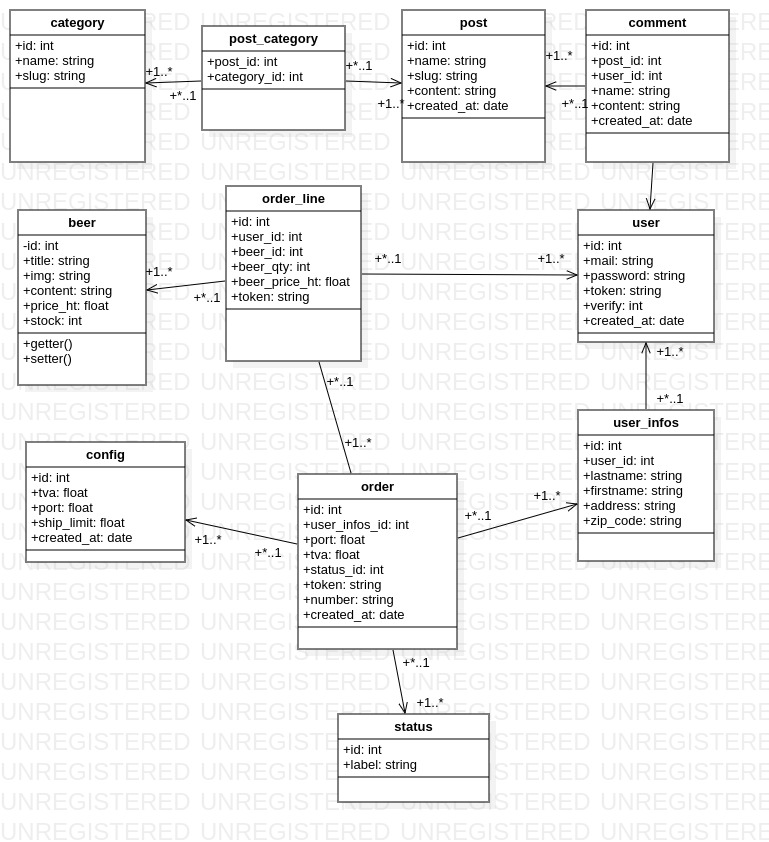

# Fusion du "site Bière PHP" et du "BLOG en MVC" 

Modèle MVC PHP avec un dossier 'Core' contenant les classes génériques réutilisables en MVC

- Les variables d'environnement, à adapter selon le serveur, sont définies dans le fichier www/src/config.php, 
à créer sur le modèle de www/src/config.sample.php :
    $env = [
        'ENV_DEV' => true, 
        'TABLE_PREFIX' => 'blog_', 
        'MYSQL_HOSTNAME' => 'blog.mysql',      
        'MYSQL_ROOT_PASSWORD' => 'blog', 
        'MYSQL_DATABASE' => 'blog', 
        'MYSQL_USER' => 'userblog', 
        'MYSQL_PASSWORD' => 'blogpwd', 
        'ENV_TVA' => 1.2, 
        'GMAIL_USER' => '', 
        'GMAIL_PWD' => '', 
        'GMAIL_PSEUDO' => '' 
    ];

- le fichier .env est utilisé dans un environnement Docker sur Linux, 
    il est remplacé par config.php pour la portabilité de certaines variables
    seules les variables suivantes sont utilisées par docker dans docker-compose.yml (voir .env.sample) :
    CONTAINER_NAME=blog
    CONTAINER_MYSQL=blog.mysql
    CONTAINER_PORT=80
    CONTAINERMAIL_PORT=1080

- sur Windows/Wamp : 
    - copier le dossier **www** dans un dossier 'sitebiere' de c:\Wamp64\www\
    - déclarer ce dossier dans le fichier hosts : 127.0.0.1 sitebiere
    - ajouter dans httpd-vhosts.conf un bloc  <VirtualHost:80> les lignes suivantes :
       
        ServerName sitebiere
        ServerAlias sitebiere
        DocumentRoot "${INSTALL_DIR}/www/sitebiere/public
    - installation du projet dans la console : 
        - cd c:\wamp64\www\sitebiere
        - composer update
        - php commande\createsql.php --demo

## Le Diagramme de classes

## le CSS utilisé dans assets/css
- Bootstrap essentiellement
- styles.css pour des détails
- admin.css pour la partie Administration

## le Javascript : assets/js/script.js
- search() : 
    recherche d'une chaine dans la page avec surlignage en rouge quand trouvé
- calcPrice(obj, id, originalPrice) : 
    calcul du prix dans les champs ddu bon de commande
- calcPriceCart(obj, id, originalPrice) : 
    calcul du prix dans les champs du panier
- deleteOfCart(id, originalPrice) : 
    supprime la ligne du panier
- totaux(prefix = "", totalPanier = 0) : 
    calcule le total du panier (si $prefix = 'P') ou du coté commande
- getProductsModal(title, img, content, price, id) : 
    affichage de la carte modale d'une bière pour l'ajouter au panier
- addCart(id, qtyId) : 
    ajouter une bière au panier par la carte modale
- addToCart(id, originalPrice) : 
    ajouter au panier par la modale 
- updateCart(id, originalPrice, prefix = "") : 
    update la ligne du panier dans la page commande ou panier
- afficheCart(data, id, originalPrice) : 
    affichage du panier et de la commande
- selectClient() : 
    lecture en base et affichage des coordonnées d'un user_infos à partir d'un select contenant la liste des user_infos_id
- selectAdresse(id) : 
    lecture en base et affichage des coordonnées d'un user_infos à partir d'un navbar
- selectStatus(id) : 
    sélection d'un état de commande pour afficher seulement les commandes ayant cet état

## LE SITE "Bread Beer Shop" : la page d'accueil
Un menu dans le Header de toutes les pages :
- Home
- Boutique
- Connexion
- Inscription
- Contact
- Blog
- Thèmes
- Panier
si utilisateur connecté :
- Home
- Boutique 
- Bon de commande
- Profil
- Déconnexion
- Contact
- Blog
- Thèmes
- Panier

### - "Boutique" : Affiche les produits (bières) 
un clic sur un produit affiche une modale pour ajouter une quantité au panier

### - "Connexion" permet de saisir son adresse mail et son mot de passe pour se connecter  
disparait si la connexion réussit pour faire apparaitre "Bon de commande", 
"Profil" et "Déconnexion"

### - "Inscription" permet de saisir ses coordonnées  
son adresse mail et son mot de passe pour s'inscrire', 
envoie un mail de confirmation pour valider l'inscription.

### - La validation de l'inscription affiche la page de connexion

### - "Bon de Commande" affiche le bon de commande à envoyer :
- un formulaire contient le nom et les coordonnées de l'acheteur
- 2 tableaux :
    - le premier contient le nom de la bière, le prix HT et TTC et la quantité à saisir par ligne et 2 boutons Ajouter et Modifier pour gérer le panier 
    - le second contient le panier et un bouton Retirer
    - le changement de quantité calcule automatiquement les prix HT et TTC de la ligne

#### un bouton "Commander" affiche la page de confirmation de la commande :
- un tableau qui récapitule les bières commandées, les frais de port (5.40 € si le total TTC est inférieur à 30 €) et le total à payer

### - La page 'Profil' contient :
- les coordonnées en formulaire à envoyer pour les modifier
- un formulaire pour changer son mot de passe
- la liste des commandes enregistrées dans la base
- un lien par commande avec le n° de la commande et le total TTC de la commande

### - "Déconnexion" déconnecte l'utilisateur et affiche la page "Identification"

### - Contact affiche un formulaire de contact
Ce formulaire envoie un email à l'adresse définie dans config.php

### Le BLOG :

- Page d'accueil : Liste des articles avec leurs catégories et un lien 'lire plus"
- Page Catégories : liste des catégories avec lien sur chacune et la liste de ses articles
- Page Catégorie : Une catégorie avec la liste de ses articles
- Page d'un article : contenu et catégories de l'article et commentaires à poster

### L'ENVIRONNEMENT physique de TRAVAIL

- LES FICHIERS: pour Github et DOCKER

- .env.sample : variables d'environnement à déclarer pour docker dans .env
- .gitignore : fichiers et dossiers à ne pas versionner
- README.md : description du projet
- docker-compose.yml : description des containers à créer par :
    docker-compose build
    docker-compose -f docker-compose.yml up -d
- start.sh : lancement de l'environnement avec docker-compose et createsql.php
- stop.sh : arrêt et destruction de l'environnement docker

- LES DOSSIERS :

#### docker : contient le fichier 'Dockerfile' 
- Dockerfile : décrit l'image 'blog' à construire par :
    docker build -t blog .

#### www : Dossier physique associé au dossier virtuel /var/www (pour docker)

- composer.json : liste des outils requis par l'application et autoload
- phpcs.xml : liste des dossiers à vérifier par l'outil phpcs
- phpunit.xml : liste des dossiers à tester par l'outil phpunit

##### www/public : Dossier exposé sur le navigateur internet                                                                          
- .htaccess : contient les règles pour utiliser Altorouter
- adminer.php : pour administrer la base
- dossier assets : contient les dossiers css, js et img 
- **index.php** : le fichier principal de l'application qui charge la classe principale **App.php**

##### www/commande : Dossier des outils externes

- createsql.php : requêtes SQL de création de la base lancées dans ./start.sh par :
docker exec blog php commande/createsql.php
- createsql : le même en mode commande sous linux

##### www/core : Environnement générique MVC

- www/core/Controller : les classes génériques de contrôleurs 
    Controller.php : contrôleur général, classe parente
    FlashController.php : Messages Flash (n'est plus utilisé, remplacé par FlashService)
    FormController.php : Contrôleur de formulaire    
    FormulaireController.php : Contrôleur de formulaire (correction, non utilisée)
    PaginatedQueryController.php : contrôleur de la pagination
    RouterController.php : contrôleur des routes
    URLController.php : contrôleur des url
    
    Database/DatabaseController.php et Database/DatabaseMysqlController.php : contrôleur des bases
    
    Helpers/TextController.php : contrôleur des méthodes sur chaines
    Helpers/MailController.php : contrôleur des envois de mail par SwiftMail
    
    Session/ArraySession.php : Classe de session dans un tableau
    Session/Flashservice.php : Messages Flash dans une session
    Session/PhpSession.php : classe de session sur $_SESSION
    Session/sessionInterface.php : Interface pour classe xxxSession

- www/core/Extension : les classes d'extensions pour librairies externes 
    Twig/FlashExtension : Extension Twig pour les messages Flash
    Twig/PriceExtension : calcul de prix TTC
    Twig/UriExtension : Calcul d'url avec http ou https

- www/core/Model : les classes génériques du modèle 
    Entity.php : Description d'un enregistrement de table
    Table.php : Classe abstraite de requêtes aux tables

##### www/src : Environnement spécifique de l'application

- **config.php** : Les variables d'environnement, à adapter selon le serveur, à créer sur le modèle de config.sample.php 

- **App.php** : la classe principale de l'application, chargée par www/public/index.php

- **www/src/Controller** : les classes spécifiques du contrôleur qui héritent de core/Controller
    
    AuthController.php : provisoire, gestion de la session de connexion
    ConfigController.php : contrôleur de la table config (tva, frais de port)
    PaginatedQueryAppController.php : contrôleur de la pagination
    
    CategoryController.php : contrôleur des catégories du BLOG
    PostController.php : contrôleur des articles du BLOG

    BeerController.php : contrôleur des produits de la boutique de bières
    CartController.php : contrôleur du panier de la boutique de bières
    OrderController.php : contrôleur du bon de commande de la boutique de bières
    UsersController.php : contrôleur des utilisateurs de la boutique de bières et du blog
    UserInfosController.php : contrôleur des clients de la boutique de bières
    UsersController.php : contrôleur des clients de la boutique de bières

- **www/src/Controller/Admin** : les classes de la partir **Administration**
    AdminController.php : page principale
    BeerEditController.php : Edition d'une bière
    CategoryEditController.php : Edition d'une catégorie
    OrderEditController.php : Edition d'une commande
    PostEditController.php : Edition d'un article du blog
    UserEditController.php : Edition d'un utilisateur du site/blog

- **www/src/Model** : les classes spécifiques du modèle qui héritent de core/Model
    
    Table/ConfigTable.php : requêtes à la table config
    Entity/ConfigEntity.php : Description d'un enregistrement de la table config

    Table/CategoryTable.php : requêtes à la table des catégories du blog
    Entity/CategoryEntity.php : Description d'un enregistrement de la table category
    
    Table/PostTable.php : requêtes à la table des articles du blog
    Entity/PostEntity.php : Description d'un enregistrement de la table post

    Table/BeerTable.php : requêtes à la table des bières
    Entity/BeerEntity.php : Description d'un enregistrement de la table des bières

    Table/StatusTable.php : requêtes à la table des états des commandes de bières
    Entity/StatusEntity.php : Description d'un enregistrement de la table desétats des commandes de bières

    Table/OrderTable.php : requêtes à la table des commandes de bières
    Entity/OrderEntity.php : Description d'un enregistrement de la table des commandes de bières

    Table/OrderLineTable.php : requêtes à la table des lignes de commandes de bières
    Entity/OrderLineEntity.php : Description d'un enregistrement de la table des lignes de commandes de bières
    
    Table/UserTable.php : requêtes à la table des utilisateurs de la boutique de bières
    Entity/UserEntity.php : Description d'un enregistrement de la table des utilisateurs de la boutique de bières
    
    Table/UserInfosTable.php : requêtes à la table des clients de la boutique de bières
    Entity/UserInfosEntity.php : Description d'un enregistrement de la table des clients de la boutique de bières

##### www/views : les vues HTML des pages de l'application 

- www/views/layout/sitebiere.twig : modèle d'une page 'modèle' du SITE BIERE avec BLOG (header + contenu + footer)
- www/views/layout/admindefault.twig : modèle d'une page 'modèle' du de l'administration du SITE BIERE (header + contenu + footer)
- anciennes versions : 
- www/views/layout/defaultBlog.twig : modèle d'une page 'modèle' du BLOG (header + contenu + footer)
- www/views/layout/defaultBiere.twig : modèle d'une page 'modèle' du site Bière (header + contenu + footer)

- www/views/category/ : templates .twig des pages pour les catégories (all.twig et show.twig)
- www/views/post/ : templates .twig des pages pour les articles (card.twig, all.twig et show.twig)
- www/views/beer/ : templates .twig des pages pour les bières (index.twig, cgv.twig, all.twig , mentions.twig, puchase.twig, orderconfirm.twig, cart.twig)
- www/views/users/ : templates .twig des pages pour les clients du site bières (connexion.twig, inscription.twig, contact.twig, profil.twig, resetpwd.twig)

- www/views/admin/index.twig : Template .twig de la page de l'administration du site

- www/views/admin/beer/ : templates .twig des pages pour l'administration des bières
- www/views/admin/category/ : templates .twig des pages pour l'administration des catégories
- www/views/admin/order/ : templates .twig des pages pour l'administration des commandes
- www/views/admin/post/ : templates .twig des pages pour l'administration des articles
- www/views/admin/user/ : templates .twig des pages pour l'administration des utilisateurs

##### www/tests : les tests unitaires des classes de l'application 

- www/tests/Core/Controller/Helpers/TextTest.php : classe de tests unitaires de la classe \Core\Controller\Helpers\TextController
- www/tests/Core/Controller/Helpers/ExercicesTest.php : classe de tests unitaires de la classe \Core\Controller\Helpers\Exercices
- www/tests/Core/Controller/Session/FlashServiceTest.php : classe de tests unitaires de la classe \Core\Controller\Session\FlashService

- www/tests/Core/Controller/FormControllerTest.php : classe de tests unitaires de la classe \Core\Controller\FormController

- www/tests/Core/Model/TableTest.php : classe de tests unitaires de la classe \Core\Model\Table
- www/tests/Core/Model/ClassTest/ClassNameTable.php : classe pour les tests unitaires de la classe \Core\Model\Table
- www/tests/Core/Model/ClassTest/MotMotTable.php : classe pour les tests unitaires de la classe \Core\Model\Table
